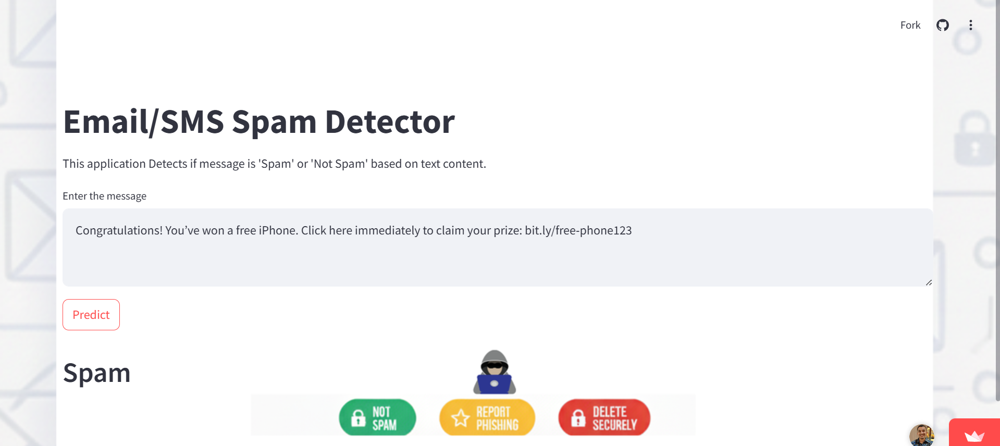
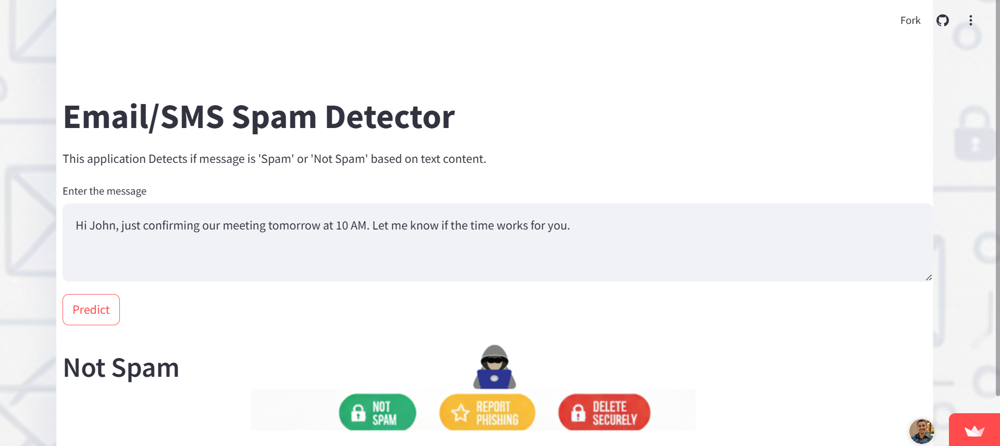

# Project Overview

This project is a machine learning model built to classify SMS messages as either "spam" or "ham" (not spam). Using Natural Language Processing (NLP) techniques and a Naive Bayes classifier, this model achieves high precision in identifying and filtering unwanted messages.

## Project Pipeline

The project was built following these key steps:
1.  **Data Loading & Cleaning:** The initial dataset (`spam.csv`) was loaded, and irrelevant columns with a high percentage of null values were dropped.
2.  **Exploratory Data Analysis (EDA):** The dataset was analyzed to understand its properties.
3.  **Feature Engineering:** New features were created from the text to improve model performance.
4.  **Text Preprocessing:** The raw text messages were cleaned and standardized for the model.
5.  **Model Building:** The processed data was vectorized using TF-IDF and fed into several Naive Bayes models.
6.  **Evaluation:** Models were compared based on accuracy and precision to select the best performer.
7.  **Serialization:** The final model and vectorizer were saved using `pickle` for future use.

---

## 📊 Exploratory Data Analysis (EDA)

### 1. Target Variable Distribution

The dataset is **imbalanced**, with a large majority of messages being "ham."
* **Ham:** 4825 messages (86.6%)
* **Spam:** 747 messages (13.4%)

This imbalance means that **Precision** is a more critical evaluation metric than Accuracy. We want to avoid classifying legitimate messages ("ham") as "spam" (False Positives).

### 2. Feature Engineering

To understand the differences between spam and ham, three new features were engineered:
* `No_of_characters`: Total number of characters in the message.
* `No_of_words`: Total number of words in the message.
* `No_of_sentence`: Total number of sentences in the message.

### 3. Key Findings from EDA

* **Spam messages tend to be longer.** Histograms showed that spam messages generally have more characters and more words than ham messages.
* **Sentence count was not a strong differentiator.**
* A **correlation heatmap** confirmed that `No_of_characters` has a moderate positive correlation (0.38) with the target variable, making it a useful feature.

---

## ⚙️ Text Preprocessing

A custom function `text_preprocessing` was created to clean the text data. This is a crucial step for any NLP model. The function performs the following operations:
1.  **Lowercase:** Converts all text to lowercase.
2.  **Tokenization:** Splits the text into a list of individual words.
3.  **Remove Special Characters:** Keeps only alphanumeric characters.
4.  **Remove Stop Words & Punctuation:** Filters out common English stop words (like "the", "is", "in") and punctuation.
5.  **Stemming:** Reduces words to their root form (e.g., "running", "ran" -> "run") using `PorterStemmer`.

---

## 🤖 Model Building & Performance

### 1. Vectorization

The preprocessed text was converted into a numerical format using **TF-IDF (Term Frequency-Inverse Document Frequency)**. TF-IDF was chosen as it gives more weight to words that are significant to a specific message, rather than words that appear frequently across all messages.

### 2. Model Selection

The data was split (80% train, 20% test) and trained on three variants of the Naive Bayes classifier, which is well-suited for text classification tasks.

Here are the performance results on the test set:

| Model | Accuracy | Precision |
| :--- | :---: | :---: |
| **Gaussian Naive Bayes (GNB)** | 0.869 | 0.525 |
| **Multinomial Naive Bayes (MNB)** | **0.958** | **1.000** |
| **Bernoulli Naive Bayes (BNB)** | 0.970 | 0.992 |

### 3. Final Model Choice: MultinomialNB

The **Multinomial Naive Bayes (MNB)** model was chosen as the final model.

> **Reasoning:** Despite `BernoulliNB` having a slightly higher accuracy, the `MultinomialNB` model achieved a perfect **Precision score of 1.0**. In the context of spam filtering, high precision is paramount. This score means that *every message the model identified as spam was actually spam* (zero False Positives), ensuring no legitimate messages were incorrectly flagged.

---

## Screenshots

---

